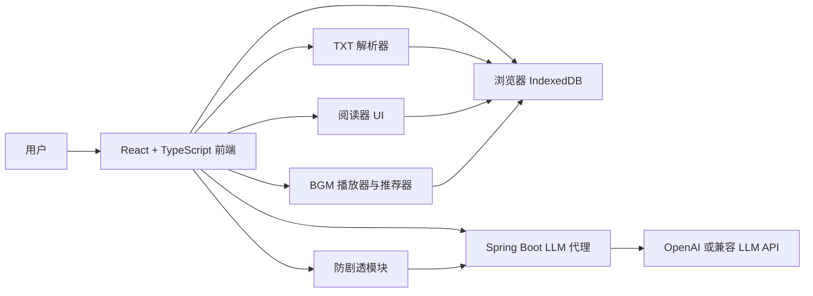

# ImmerseRead 设计规格说明

日期：2026-08-06

## 1. 问题陈述

ImmerseRead 是一个面向小说和网文读者的本地优先沉浸式 TXT 阅读器。它要解决三个真实问题：

- TXT 小说文件格式经常不稳定：章节标题不统一，编码可能不同，读者需要先整理文本才能舒服阅读。
- 很多读者喜欢配合 BGM 阅读，但手动挑选适合当前剧情氛围的音乐会打断沉浸感。
- 读者常常想找一个“懂当前剧情”的书友一起吐槽、回忆前情、猜后续，但普通 LLM 容易回答得像工具，也可能不小心剧透未读内容。

目标用户是拥有本地 TXT 小说文件、偏好网文或类型小说阅读体验的读者。项目值得做，是因为它不是单纯的阅读器，也不是严肃文学分析工具，而是把本地阅读、氛围 BGM、轻量批注和不剧透的 LLM 书友整合成一个完整的沉浸式阅读流程。

核心产品承诺：

> 上传自己的 TXT 小说，在本地阅读；系统根据当前剧情推荐氛围 BGM，并提供一个只知道你已读内容的 AI 书搭子陪你吐槽、回忆和一起猜。

## 2. 用户故事

### 用户故事 1：上传 TXT 并开始阅读

作为小说读者，我希望上传自己的 TXT 小说后，系统能够自动识别章节或生成阅读片段，这样我不用手动整理格式就能开始阅读。

验收标准：

- 应用支持上传 `.txt` 文件。
- 能识别常见章节格式，例如 `第一章`、`第1章`、`卷一`、`Chapter 1` 和数字编号标题。
- 章节识别不可靠时，系统按固定字数生成阅读片段。
- 解析完成后可以进入阅读界面。
- 原文内容不丢失、不乱序。

### 用户故事 2：长时间舒适阅读

作为小说读者，我希望可以调整字号、行高、主题和阅读宽度，这样我可以长时间阅读而不疲劳。

验收标准：

- 阅读器支持字号、行高、阅读宽度和主题设置。
- 阅读进度保存在本地。
- 刷新页面后阅读偏好仍然保留。
- 桌面端和移动端文本都不会溢出或重叠。

### 用户故事 3：根据当前剧情获得 BGM 推荐

作为小说读者，我希望系统根据当前章节或片段的氛围推荐合适的 BGM，这样我可以更快进入故事状态。

验收标准：

- 当前片段可以生成氛围标签。
- 当存在可用曲目时，BGM 推荐器至少返回一首推荐曲目。
- 推荐结果包含简短理由。
- 切换 BGM 前需要用户确认。
- LLM 氛围分析失败时，系统可以回退到默认推荐。

### 用户故事 4：导入私人 BGM 音频库

作为小说读者，我希望导入自己的本地音乐并添加氛围标签，这样我可以建立私人阅读歌单。

验收标准：

- 支持上传 `mp3`、`wav`、`ogg` 音频。
- 上传音频保存在浏览器本地存储中，不发送到后端。
- 用户可以编辑曲名、情绪标签、场景标签和强度等元数据。
- 不支持的音频格式会给出清晰错误提示。
- 播放器支持播放、暂停、切换和锁定当前曲目。

### 用户故事 5：创建轻量批注

作为小说读者，我希望选中文本后高亮并写一句想法，这样我可以记录阅读时的即时感受。

验收标准：

- 用户可以选中文本创建高亮。
- 用户可以给高亮添加短批注。
- 批注绑定到书籍、片段和文本范围。
- 重新打开书籍后高亮可以恢复。
- 删除批注后对应高亮消失。

### 用户故事 6：带着批注询问书搭子

作为小说读者，我希望把选中文本和自己的批注一键带入书搭子聊天，这样我可以围绕阅读时的想法继续讨论，而不需要复制粘贴原文。

验收标准：

- 每条批注都有“问书搭子”的入口。
- 聊天请求包含选中文本、批注内容、当前片段和防剧透上下文。
- 回复与当前书籍和片段关联。
- 聊天记录保存在本地，并能恢复。

### 用户故事 7：和不剧透的书搭子聊天

作为小说读者，我希望 AI 书搭子只基于我已经读到的位置回答问题，这样我可以放心吐槽、回忆和猜剧情，而不会被剧透。

验收标准：

- LLM 请求不包含当前阅读位置之后的正文。
- 面对高剧透风险问题时，回答只基于已读线索。
- 默认回复较短，通常为 1-4 句。
- 语气像轻松的网文书友，而不是严肃文学评论。
- 使用测试小说验证：未读章节中的答案不会进入 LLM 请求上下文。

## 3. 功能规约

### 3.1 TXT 解析与阅读核心

输入：

- 用户上传的 `.txt` 文件。
- 当自动解码失败时，用户手动选择的编码。

行为：

- 解码文本，规范换行，同时保留原始字符顺序。
- 使用常见中文和英文标题模式尝试章节识别。
- 如果识别出的章节数量低于可靠阈值，则按约 3000-5000 个中文字符切成阅读片段，并尽量在段落边界切分。
- 在浏览器本地存储中创建 `Book`、`Segment` 和初始 `ReadingProgress` 记录。

输出：

- 一本本地书籍记录。
- 一组有序章节或阅读片段。
- 可直接进入阅读器的文本结构。

边界条件：

- 不提供在线小说搜索或下载。
- 第一版只支持 TXT，不支持 EPUB 或 PDF。
- 大文件需要有进度反馈，不能让界面长时间无响应。

错误处理：

- 编码识别失败时，让用户选择 UTF-8 或 GBK。
- 空文件直接拒绝，并显示清晰提示。
- 章节解析失败时，自动回退到固定字数切片。

### 3.2 阅读器 UI

输入：

- 书籍和片段记录。
- 用户阅读偏好。

行为：

- 使用滚动式阅读界面渲染当前片段。
- 保存阅读位置和阅读偏好。
- 提供低打扰的字号、行高、主题、BGM、批注和书搭子入口。

输出：

- 响应式沉浸阅读界面。
- 更新后的本地阅读进度和偏好。

边界条件：

- 第一版不要求仿真翻页动画。
- 阅读界面不做成后台仪表盘，也不做成知识管理工作区。

错误处理：

- 片段数据缺失时显示可恢复的本地书库错误。
- 本地存储写入失败时提示用户进度可能无法保存。

### 3.3 氛围分析

输入：

- 当前章节或阅读片段文本。

行为：

- 前端向后端发送一次氛围分析请求。
- Spring Boot 后端调用 LLM，要求返回结构化 JSON。
- 后端校验并规范化 JSON 结果。

输出：

- `AtmosphereProfile`，包含情绪、场景、节奏、强度、能量、阴暗度、温暖度、标签和章节结束轻提示。

边界条件：

- 氛围分析是由用户或片段进入行为触发的单次请求。
- 不为了聊天分析未读章节。
- 不形成自主循环，因此不构成 agent。

错误处理：

- JSON 解析失败时进行一次修复或重试。
- 多次失败后返回中性默认氛围。

### 3.4 BGM 音频库与推荐

输入：

- 内置的免版权或自制演示 BGM 元数据。
- 用户上传的本地音频和元数据。
- 当前片段的 `AtmosphereProfile`。

行为：

- 将用户上传的音频保存在本地。
- 根据情绪标签重合、场景标签重合，以及 energy、darkness、warmth 数值距离计算匹配分。
- 推荐 1-3 首 BGM，并给出简短理由。
- 切换曲目前请求用户确认。

输出：

- 排序后的 BGM 推荐结果。
- 当前播放状态。

边界条件：

- 第一版不提供音乐搜索、下载、公开分享或云同步。
- 用户上传音频被视为私人本地音频库。

错误处理：

- 不支持的音频格式直接拒绝。
- 音频文件引用丢失时，将曲目标记为不可用。
- 没有匹配曲目时返回默认环境音选项。

### 3.5 批注

输入：

- 用户选中的文本。
- 可选的批注内容和颜色。

行为：

- 创建绑定稳定文本范围的高亮。
- 将批注保存在本地。
- 允许用户把批注内容和原文发送给书搭子。

输出：

- 可恢复的高亮。
- 批注记录。
- 可选的聊天请求上下文。

边界条件：

- 第一版不做复杂标签系统、双链笔记、关系图或类似 Obsidian 的知识库。

错误处理：

- 空选择不创建批注。
- 如果文本范围无法精确恢复，系统提示用户，并尝试用选中文本做模糊匹配。

### 3.6 防剧透模块

输入：

- `Book`、`Segment`、`ReadingProgress`、选中文本、批注、用户问题和请求的上下文窗口。

行为：

- 根据阅读进度计算最大允许字符位置。
- 拒绝或裁剪所有超过该位置的上下文。
- 使用关键词识别剧透风险，例如“后来”“结局”“真相”“凶手”“最终 boss”“背叛”等。
- 为 LLM 请求附加防剧透指令和上下文范围元数据。
- 保存上下文范围元数据，便于测试和调试。

输出：

- 允许发送给 LLM 的已读上下文。
- `spoilerRisk` 风险分类。
- 上下文起止范围元数据。

边界条件：

- 只靠提示词不算防剧透；未读文本必须从工程上不进入请求。
- 第一版默认严格防剧透。

错误处理：

- 如果选中文本超过当前阅读进度，拒绝聊天请求并提示原因。
- 如果没有可用上下文，只基于选中文本和用户问题回答。

### 3.7 书搭子 LLM 聊天

输入：

- 用户问题。
- 可选的选中文本和批注。
- 经过防剧透模块裁剪后的上下文。
- 当前模式，默认是“同好型书友”。

行为：

- 通过 Spring Boot 后端构造单次 LLM 聊天请求。
- 默认使用轻人设“书搭子”。
- 默认回复短、自然、有网文读者同好感。
- 支持回忆前情、吐槽、一起猜、解释当前段落、分析当前人物动机和防剧透问答。

输出：

- 书搭子的回复。
- 保存在本地的 `ChatMessage` 记录。

边界条件：

- 不做自主规划。
- 不让 LLM 自主调用工具。
- 不做自动多步循环。
- 不联网查询小说内容。

错误处理：

- 缺少 API key 时禁用 LLM 功能，但阅读、批注和 BGM 本地功能仍然可用。
- LLM 供应商失败时返回友好的重试提示。

### 3.8 Spring Boot LLM 代理

输入：

- 前端发来的聊天或氛围分析请求。
- 环境变量中的 LLM 供应商配置。

行为：

- 校验请求结构和大小。
- 从环境变量读取 API key。
- 通过适配器调用 OpenAI 或 OpenAI-compatible 接口。
- 返回规范化后的结果。
- 日志只记录 request id、状态、耗时、模型和字符数。

输出：

- 聊天文本或结构化氛围分析结果。

边界条件：

- 第一版后端不持久化小说正文、批注、BGM 文件或聊天历史。
- 后端不向前端暴露供应商凭据。

错误处理：

- 缺少凭据时返回类型明确的功能禁用响应。
- 供应商错误需要脱敏后再返回。
- 请求过大时直接拒绝。

## 4. 非功能性需求

### 4.1 性能

- 10 MB 以内的 TXT 文件应能在普通笔记本上以可接受的交互时间完成解析。
- 大文件解析时需要进度反馈，不能让 UI 长时间无响应。
- 长片段滚动阅读应保持流畅。
- LLM 请求需要限制上下文大小，避免超出模型窗口或造成过高延迟。

### 4.2 安全与凭据威胁模型

需要保护的资产：

- LLM 供应商 API key。
- 用户上传的 TXT 小说内容。
- 用户批注和聊天记录。
- 用户上传的 BGM 音频。

威胁与缓解：

- API key 被提交到仓库：使用 `.env`、`.env.example` 和 `.gitignore`，并在提交前检查 Git 状态与历史中是否出现真实 key。
- API key 暴露给浏览器：所有 LLM 请求都经过 Spring Boot 后端。
- 错误响应泄露 API key：后端对供应商错误做脱敏处理。
- 日志泄露小说正文：日志只记录元数据，不记录原文。
- 小说文本被集中上传服务器：默认把书籍、批注、进度、聊天和 BGM 保存在浏览器本地。
- 未读内容泄露给 LLM：前端防剧透模块裁剪上下文，并用测试验证请求范围。
- 请求体过大导致资源消耗：后端限制请求体大小和字符数。
- `.env` 明文泄露：`.env` 仅作为开发和容器部署 fallback，README 必须说明它是明文文件，目标机器上的进程环境也可能被有权限的本机用户看到。

凭据生命周期：

- 录入：优先使用后端提供的凭据管理命令以隐藏输入方式录入 key，并写入操作系统凭据管理器；Windows 目标机使用 Windows Credential Manager。容器或 CI 环境可复制 `.env.example` 为 `.env`，填写 `OPENAI_API_KEY`。
- 查看状态：后端健康检查或凭据管理命令只返回“已配置 / 未配置”，不得回显明文 key。
- 更新：重新运行凭据录入命令覆盖旧 key；`.env` 模式下修改 `.env` 后重启后端。
- 清除：运行凭据清除命令删除系统凭据；`.env` 模式下删除 key 后重启后端。清除后 LLM 功能进入禁用状态。
- 风险说明：系统凭据管理器比 `.env` 更适合个人本机运行；`.env` 是明文 fallback，仅用于开发、Docker Compose 和课程冷启动验证。

### 4.3 可用性

- 打开书籍后的第一屏是阅读器，而不是营销页。
- AI 和 BGM 控件保持低打扰。
- 书搭子默认短回复。
- 章节结束提示只是可选入口，不主动打断阅读。

### 4.4 可观测性

- 后端记录 request id、接口名、状态、耗时、模型、输入字符数和错误类别。
- 开发模式下，前端可以显示本次 LLM 请求的上下文范围，用于调试防剧透。
- 日志不得包含 API key 或小说原文。

### 4.5 可靠性

- 没有 LLM 凭据时，阅读、批注和本地 BGM 仍然可用。
- 氛围分析失败时，BGM 推荐回退到中性默认值。
- 本地存储失败时要明确提示用户。

## 5. 系统架构



### 5.1 组件说明

- 前端 Web 应用：负责产品 UI、本地解析、本地存储、BGM 播放、批注和防剧透上下文构造。
- Spring Boot 后端：负责 LLM 代理、凭据隔离、请求校验、响应规范化和脱敏日志。
- 浏览器 IndexedDB：本地保存书籍、片段、进度、批注、聊天记录、氛围标签、BGM 元数据和上传音频。
- 外部 LLM 供应商：提供单次氛围分析和单次书搭子回复。

### 5.2 主要数据流

TXT 上传：

```text
用户上传 TXT
-> 前端解码文本
-> 章节解析器运行
-> 必要时回退到固定切片
-> 书籍和片段保存到 IndexedDB
-> 打开阅读器
```

氛围分析：

```text
当前片段文本
-> 前端调用 /api/llm/atmosphere
-> 后端单次调用 LLM
-> 后端校验结构化 JSON
-> 氛围标签保存到本地
-> BGM 推荐器给出曲目
```

书搭子聊天：

```text
用户提问或发送批注
-> 防剧透模块构造已读上下文
-> 前端调用 /api/llm/chat
-> 后端校验并单次调用 LLM
-> 回复保存到本地聊天记录
```

批注带入聊天：

```text
用户高亮文本并写批注
-> 批注保存到本地
-> 用户点击“问书搭子”
-> 选中文本和批注进入防剧透聊天上下文
```

### 5.3 外部依赖

- OpenAI API 或 OpenAI-compatible 接口。
- 浏览器 File API，用于 TXT 和音频导入。
- 浏览器 IndexedDB，用于本地持久化。
- Docker，用于课程分发与冷启动验证。

## 6. 数据模型

### 6.1 Book

- `id`：字符串，主键。
- `title`：书名。
- `author`：可选作者。
- `sourceFileName`：原始文件名。
- `createdAt`：创建时间。
- `updatedAt`：更新时间。
- `totalChars`：总字符数。
- `parserVersion`：解析器版本。

### 6.2 Segment

- `id`：字符串，主键。
- `bookId`：所属书籍。
- `index`：片段顺序。
- `title`：章节或片段标题。
- `startChar`：全书起始字符位置。
- `endChar`：全书结束字符位置。
- `text`：片段正文。
- `type`：`chapter` 或 `chunk`。
- `parseConfidence`：`high`、`medium` 或 `low`。
- `atmosphereStatus`：`pending`、`ready` 或 `failed`。

约束：

- 同一本书的片段必须有序且不重叠。
- `startChar < endChar`。

### 6.3 ReadingProgress

- `bookId`：主键。
- `segmentId`：当前片段。
- `charOffsetInSegment`：片段内字符偏移。
- `absoluteCharOffset`：全书绝对字符偏移。
- `updatedAt`：更新时间。

约束：

- `absoluteCharOffset` 是防剧透上下文的最大边界。

### 6.4 Annotation

- `id`：字符串，主键。
- `bookId`：所属书籍。
- `segmentId`：所属片段。
- `startChar`：片段内起始字符位置。
- `endChar`：片段内结束字符位置。
- `selectedText`：选中文本。
- `note`：批注内容。
- `color`：高亮颜色。
- `createdAt`：创建时间。
- `updatedAt`：更新时间。

约束：

- 批注范围必须属于对应片段。

### 6.5 ChatMessage

- `id`：字符串，主键。
- `bookId`：所属书籍。
- `segmentId`：所属片段。
- `role`：`user` 或 `assistant`。
- `content`：消息内容。
- `selectedText`：可选选中文本。
- `annotationId`：可选关联批注。
- `contextStartChar`：本次请求上下文起始位置。
- `contextEndChar`：本次请求上下文结束位置。
- `spoilerPolicy`：`strict`。
- `createdAt`：创建时间。

约束：

- 消息创建时，`contextEndChar <= ReadingProgress.absoluteCharOffset`。

### 6.6 AtmosphereProfile

- `segmentId`：主键。
- `moods`：情绪标签数组。
- `scenes`：场景标签数组。
- `pace`：`slow`、`medium` 或 `fast`。
- `intensity`：0 到 1 的数值。
- `energy`：0 到 1 的数值。
- `darkness`：0 到 1 的数值。
- `warmth`：0 到 1 的数值。
- `tags`：其他标签数组。
- `chapterEndPrompt`：章节结束轻提示。
- `modelName`：生成模型名。
- `createdAt`：创建时间。

### 6.7 BgmTrack

- `id`：字符串，主键。
- `title`：曲目名。
- `source`：`built-in` 或 `user-uploaded`。
- `fileRef`：本地文件引用。
- `moods`：情绪标签数组。
- `scenes`：场景标签数组。
- `energy`：0 到 1 的数值。
- `darkness`：0 到 1 的数值。
- `warmth`：0 到 1 的数值。
- `tempo`：`slow`、`medium` 或 `fast`。
- `licenseNote`：版权或来源说明。
- `createdAt`：创建时间。

### 6.8 BgmRecommendation

- `id`：字符串，主键。
- `segmentId`：对应片段。
- `trackId`：推荐曲目。
- `score`：匹配分。
- `reason`：推荐理由。
- `createdAt`：创建时间。

## 7. 凭据与分发设计

### 7.1 凭据存储

第一版凭据来源按优先级读取：

1. 操作系统凭据管理器中的 `immerseread.openai.api-key`。
2. 后端环境变量或 `.env` 中的 `OPENAI_API_KEY`。

前端永远不保存、不接收供应商凭据。后端不得把 key 写入日志、错误响应、聊天记录或任何数据库。

开发和容器 fallback 使用：

```text
OPENAI_API_KEY=
OPENAI_BASE_URL=
OPENAI_MODEL=
```

`.env` 是明文文件，必须加入 `.gitignore`；README 需要明确说明 `.env` 与进程环境变量的可见性风险。

### 7.2 凭据录入、查看状态、更新与清除

- 录入：运行后端凭据管理命令，例如 `java -jar backend.jar credentials set`，通过隐藏输入录入 key；开发和 Docker Compose 可使用 `.env`。
- 查看状态：运行 `java -jar backend.jar credentials status` 或访问健康检查，只显示 configured/unconfigured。
- 更新：重新运行 `credentials set` 覆盖旧 key；`.env` 模式下修改 `.env` 后重启服务。
- 清除：运行 `java -jar backend.jar credentials clear` 删除系统凭据；`.env` 模式下删除 `.env` 中的 key 后重启服务。
- 降级：没有 key 时，阅读、批注、本地 BGM 仍可用，LLM 功能显示“尚未配置”。

### 7.3 分发形态

目标平台：

- Windows、macOS、Linux 上的本地浏览器。
- 支持 Docker 的课程验收环境。

第一版分发命令：

```text
docker compose up --build
```

预期服务：

- 前端：`http://localhost:5173`
- 后端：`http://localhost:8080`

后续可选方向：

- 构建为单个 Docker 镜像，由 Spring Boot 托管前端构建产物。
- 将容器镜像推送到公开 registry，并在 README 写出 `docker pull` 与 `docker run --env-file .env` 示例。
- 部署到支持免费额度的平台，提供可访问的 WebUI URL；生产部署仍不保存用户小说正文。

## 8. 技术选型与理由

### 8.1 前端

- React + TypeScript + Vite。
- 理由：适合快速构建复杂交互界面，类型安全较好，测试生态成熟，适合阅读器、本地状态和富交互。

### 8.2 UI 设计系统

- 前端参考 Open Design 设计系统。
- 阅读器应当安静、沉浸、内容优先，而不是 AI 后台或管理控制台。
- 卡片只用于重复项目、弹窗或工具面板，正文阅读区以排版和留白为核心。

### 8.3 本地存储

- IndexedDB，并封装 storage adapter。
- 理由：相比 localStorage，IndexedDB 更适合保存较大的文本记录和音频 Blob，同时能保持用户内容本地优先。

### 8.4 后端

- Java + Spring Boot。
- 理由：项目开发者更熟悉 Java；Spring Boot 适合清晰组织 Controller、Service、配置、校验、日志和 Docker 化部署。

### 8.5 服务端数据库

- 第一版不使用 MySQL。
- 理由：产品定位是本地优先。把小说、批注和 BGM 存到服务端会增加隐私、版权、账号、多用户隔离和删除流程复杂度。MySQL 可以在后续云同步或账号体系中引入。

### 8.6 LLM 供应商

- 默认使用 OpenAI API，并通过 `OPENAI_BASE_URL` 保留接入 OpenAI-compatible 服务的可能。
- 理由：聊天和结构化输出能力稳定；后端适配器可以隔离供应商细节。

### 8.7 测试

- 前端单元测试：Vitest。
- 前端组件测试：React Testing Library。
- E2E 测试：Playwright。
- 后端测试：JUnit + Spring Boot Test。

### 8.8 部署

- 第一版使用 Docker Compose。
- 理由：便于课程冷启动验证，也能清楚分离前端和后端服务。

## 9. 验收标准

### 9.1 TXT 解析

- 带章节标题的 TXT 能生成有序章节目录。
- 无可靠章节标题的 TXT 能生成有序阅读片段。
- 解析后原文不丢失、不乱序。
- 单元测试覆盖中文章节标题、数字编号标题和 fallback 切片。

### 9.2 阅读器 UI

- 用户可以打开解析后的书籍并滚动阅读。
- 阅读进度刷新后仍然保留。
- 字号、行高、主题和阅读宽度设置可保存。
- 打开书籍后的第一屏是阅读体验。

### 9.3 BGM

- 应用包含至少一组内置免版权或自制演示 BGM。
- 用户可以上传本地音频并编辑元数据。
- 当前片段氛围可以生成排序后的 BGM 推荐。
- 除非用户手动选择，否则切换曲目前需要确认。

### 9.4 批注

- 用户可以高亮选中文本并添加批注。
- 高亮刷新后仍然存在。
- 批注可以带入书搭子聊天。

### 9.5 防剧透

- 允许发送给 LLM 的上下文不得超过当前阅读进度。
- 测试证明未读正文不会进入聊天 payload。
- 高剧透风险问题只能得到基于已读线索的不确定回答。

### 9.6 书搭子

- 默认回复较短，通常为 1-4 句。
- 语气符合轻松的网文书友。
- 可以回忆已读剧情、讨论选中段落，并基于当前线索一起猜。
- 不声称知道未读内容。

### 9.7 后端 LLM 代理

- API key 只从环境变量读取。
- 缺少 key 时，LLM 接口优雅降级。
- 日志不包含小说正文或凭据。
- 后端强制请求大小限制。

### 9.8 分发与测试

- `docker compose up --build` 可以启动前端和后端。
- 有一条命令可以运行前后端测试。
- CI 覆盖解析器、防剧透模块、BGM 推荐器、LLM adapter 和后端请求校验。

## 10. 明确不做的内容

- 在线小说搜索或下载。
- 音乐搜索、下载、公开分享或分发。
- 服务端保存小说正文、批注、聊天记录或上传音频。
- 复杂人物关系图谱或 Obsidian 式知识库。
- 第一版不做仿真翻页动画。
- 阅读中自动弹幕式陪读。
- 自主 agent 循环或 LLM 工具调用。

## 11. 主要风险

- TXT 编码和混乱格式可能需要持续改进解析器。
- 长篇网文会带来上下文裁剪和摘要管理压力。
- BGM 推荐质量依赖曲目元数据质量。
- 防剧透必须用测试证明，不能只依赖提示词。
- 不同浏览器对 IndexedDB 的容量限制不同。
