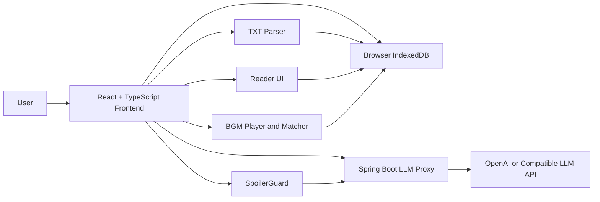

# ImmerseRead Design Spec

Date: 2026-08-06

## 1. Problem Statement

ImmerseRead is a local-first immersive TXT novel reader for web-novel and genre-fiction readers. It solves three common reading problems:

- TXT novel files are often messy: chapter headings may be inconsistent, encoding may vary, and readers still need a comfortable reading surface.
- Many readers enjoy reading with background music, but matching music to the current scene is manual and interrupts immersion.
- Readers often want a companion to recall prior plot, discuss suspicious characters, and react emotionally, but ordinary LLM chat can feel tool-like or can accidentally spoil future content.

The target users are novel and web-novel readers who own local TXT files and want a richer personal reading experience without using an online novel catalog. The product is worth building because it combines a practical reader, mood-aware BGM recommendation, lightweight annotation, and a spoiler-safe LLM companion into one coherent reading workflow.

The core product promise:

> Upload your own TXT novel, read locally with atmosphere-aware BGM, and chat with a spoiler-safe AI reading buddy that only knows what you have already read.

## 2. User Stories

### Story 1: Upload TXT and Start Reading

As a novel reader, I want to upload my own TXT novel and have the app identify chapters or create readable chunks, so that I can start reading without manually cleaning the file.

Acceptance criteria:

- The app accepts `.txt` uploads.
- Common chapter headings such as `第一章`, `第1章`, `卷一`, `Chapter 1`, and numbered headings are recognized.
- If chapter recognition is unreliable, the app falls back to fixed-size readable chunks.
- Parsed text can be opened in the reader.
- Text order and content are preserved.

### Story 2: Read Comfortably for Long Sessions

As a novel reader, I want to adjust typography, theme, and reading width, so that I can read comfortably for long periods.

Acceptance criteria:

- The reader supports font size, line height, reading width, and theme settings.
- Reading progress is saved locally.
- Preferences persist after refresh.
- Text remains readable on desktop and mobile layouts.

### Story 3: Get BGM Recommendations for the Current Scene

As a novel reader, I want the app to recommend BGM based on the current segment atmosphere, so that I can enter the story mood faster.

Acceptance criteria:

- The app can generate an atmosphere profile for the current segment.
- The BGM matcher returns at least one matching track when tracks are available.
- Recommendations include a short reason.
- The app asks for confirmation before switching tracks.
- If LLM analysis fails, the app falls back to default recommendations.

### Story 4: Import a Private BGM Library

As a novel reader, I want to import my own local music files and tag them, so that I can build a private reading playlist.

Acceptance criteria:

- The app accepts `mp3`, `wav`, and `ogg` uploads.
- Uploaded audio stays in browser-local storage.
- Users can edit title, mood tags, scene tags, and intensity metadata.
- Unsupported formats produce a clear error.
- Playback supports play, pause, track switching, and lock-current-track.

### Story 5: Create Lightweight Annotations

As a novel reader, I want to highlight selected text and write a short note, so that I can keep my immediate reading thoughts.

Acceptance criteria:

- Users can select text and create a highlight.
- Users can attach a short note to the highlight.
- Annotations are bound to book, segment, and text range.
- Highlights are restored after reopening the book.
- Deleting an annotation removes its highlight.

### Story 6: Ask the Companion About an Annotation

As a novel reader, I want to send a selected passage and my note to the AI reading buddy, so that I can discuss my own reading reaction without copying text manually.

Acceptance criteria:

- Each annotation has an action to ask the companion.
- The chat request includes selected text, the annotation note, the current segment, and spoiler-safe context.
- The response is linked to the current book and segment.
- Chat history is restored locally.

### Story 7: Chat With a Spoiler-Safe Reading Buddy

As a novel reader, I want the AI companion to answer only from what I have already read, so that I can safely ask questions, complain, recall plot, and guess future developments.

Acceptance criteria:

- LLM requests never include text after the current reading position.
- High-risk future-oriented questions are answered only from read-so-far evidence.
- Default responses are short, usually 1-4 sentences.
- The companion uses a casual web-novel-reader tone rather than academic analysis.
- A test novel with hidden future answers proves that unread answers are not included in the LLM payload.

## 3. Functional Specification

### 3.1 TXT Parsing and Reader Core

Input:

- User-uploaded `.txt` file.
- Optional user-selected encoding if automatic decoding fails.

Behavior:

- Decode the text, normalize line endings, and preserve original character order.
- Try chapter recognition with common Chinese and English heading patterns.
- If recognized chapters are fewer than the reliability threshold, split text into chunks of about 3000-5000 Chinese characters, preferring paragraph boundaries.
- Create `Book`, `Segment`, and initial `ReadingProgress` records in browser-local storage.

Output:

- A local book record with ordered segments.
- A reader-ready text structure.

Boundary conditions:

- No online book search or download.
- First version supports TXT only, not EPUB or PDF.
- Very large files should be parsed incrementally or show progress.

Error handling:

- Encoding failure asks the user to choose UTF-8 or GBK.
- Empty files are rejected with a clear message.
- Parser failure falls back to fixed-size chunks.

### 3.2 Reader UI

Input:

- Book and segment records.
- User reading preferences.

Behavior:

- Render the current segment in a scroll-based reading layout.
- Persist reading position and preferences.
- Provide low-distraction controls for typography, theme, BGM, annotations, and companion chat.

Output:

- A responsive reading experience.
- Updated local progress and preferences.

Boundary conditions:

- Simulated page-turn animation is not required for the first version.
- The UI should not become a dashboard or knowledge-management workspace.

Error handling:

- Missing segment data shows a recoverable local-library error.
- Storage write failure warns users that progress may not persist.

### 3.3 Atmosphere Analysis

Input:

- Current segment text, limited by payload size.

Behavior:

- Send one backend request to analyze segment atmosphere.
- Backend calls the LLM provider and asks for structured JSON.
- Validate and normalize the JSON response.

Output:

- `AtmosphereProfile` with moods, scenes, pace, intensity, energy, darkness, warmth, tags, and a chapter-end prompt.

Boundary conditions:

- The analysis is single-shot and user or segment triggered.
- It does not analyze unread future content for chat.
- It does not create an autonomous loop.

Error handling:

- Invalid JSON triggers one repair or retry path.
- Repeated failure returns a fallback neutral profile.

### 3.4 BGM Library and Recommendation

Input:

- Built-in royalty-free or self-produced demo BGM metadata.
- Optional user-uploaded local audio and metadata.
- Current `AtmosphereProfile`.

Behavior:

- Store uploaded audio locally.
- Match BGM tracks by mood overlap, scene overlap, and numeric distance across energy, darkness, and warmth.
- Recommend 1-3 tracks with reasons.
- Ask user confirmation before switching tracks.

Output:

- Ranked BGM recommendations.
- Playback state.

Boundary conditions:

- No music search, download, public sharing, or cloud sync in the first version.
- Uploaded audio is treated as the user's private local library.

Error handling:

- Unsupported audio formats are rejected.
- Missing audio file references mark tracks as unavailable.
- No matching tracks returns a default ambient option.

### 3.5 Annotation

Input:

- User text selection.
- Optional note text and color.

Behavior:

- Create highlights bound to stable text ranges.
- Store annotations locally.
- Allow users to send annotation context to the companion.

Output:

- Restorable highlights.
- Annotation records.
- Optional chat request seed.

Boundary conditions:

- No complex backlink system, graph view, or Obsidian-like knowledge base in the first version.

Error handling:

- Invalid empty selections are ignored.
- If text range cannot be restored exactly, show a warning and attempt fuzzy matching by selected text.

### 3.6 Spoiler Guard

Input:

- `Book`, `Segment`, `ReadingProgress`, selected text, annotation, user question, and requested context window.

Behavior:

- Compute the maximum allowed character offset from reading progress.
- Reject or trim any context beyond that offset.
- Classify spoiler risk with keywords such as later, ending, truth, murderer, final boss, betrayal, and Chinese equivalents.
- Add spoiler-safe instruction metadata to the LLM request.
- Record context range metadata for debugging and tests.

Output:

- `AllowedContext` for the companion.
- `spoilerRisk` classification.
- Context range metadata.

Boundary conditions:

- Prompting alone is not considered sufficient; unread text must not enter the request.
- The first version defaults to strict spoiler prevention.

Error handling:

- If selected text is beyond reading progress, reject the chat request with a clear message.
- If no context is available, answer from the selected text and current user question only.

### 3.7 Reading Companion

Input:

- User question.
- Optional selected text and annotation.
- Spoiler-safe allowed context.
- Current mode, defaulting to casual reading buddy.

Behavior:

- Construct a single LLM chat request through the Spring Boot backend.
- Use a light-persona companion named "书搭子" by default.
- Keep default responses short, natural, and web-novel-reader friendly.
- Support recall, complaining, guessing, passage explanation, current-motivation discussion, and spoiler-safe Q&A.

Output:

- Assistant response.
- Local `ChatMessage` records.

Boundary conditions:

- No autonomous planning.
- No tool calling by the LLM.
- No automatic multi-step loop.
- No web search for novel content.

Error handling:

- Missing API key disables LLM features but leaves reader, annotations, and BGM playback available.
- Provider failure returns a friendly retry message.

### 3.8 Spring Boot LLM Proxy

Input:

- Atmosphere or chat request from frontend.
- Environment variables for provider configuration.

Behavior:

- Validate request schema and size.
- Load API key from environment variables.
- Call OpenAI or an OpenAI-compatible endpoint through an adapter.
- Return normalized responses.
- Log only request id, status, duration, model, and character counts.

Output:

- Chat text or structured atmosphere profile.

Boundary conditions:

- Backend does not persist novel text, annotations, BGM files, or chat history in the first version.
- Backend does not expose provider credentials to frontend.

Error handling:

- Missing credentials return a typed disabled-feature response.
- Provider errors are sanitized.
- Oversized requests are rejected.

## 4. Non-Functional Requirements

### Performance

- TXT files up to 10 MB should parse within an acceptable interactive time on a typical laptop.
- Parsing large files should not permanently block the UI; progress feedback is required if parsing takes noticeable time.
- Reader scrolling should remain smooth for long segments.
- LLM payloads should be size-limited and context-window aware.

### Security and Credential Threat Model

Assets:

- LLM provider API key.
- User-uploaded TXT content.
- User annotations and chat history.
- User-uploaded BGM files.

Threats and mitigations:

- API key committed to repository: use `.env`, `.env.example`, and `.gitignore`.
- API key exposed to browser: route all LLM calls through Spring Boot.
- API key leaked in errors: sanitize provider errors before returning responses.
- Novel text leaked through logs: log metadata only, never raw text.
- Novel text centralized on server: keep books, annotations, progress, chat, and BGM local by default.
- Unread content leaked to LLM: enforce `SpoilerGuard` context trimming before requests and verify request ranges.
- Oversized prompt abuse: backend request body and character limits.

Credential lifecycle:

- Input: deployment operator writes `OPENAI_API_KEY` into `.env` or target machine environment variables.
- Update: change environment variable and restart backend.
- Clear: remove key and restart backend; LLM features become disabled.
- Validation: backend exposes health status that reports LLM configured/unconfigured without revealing key.

### Usability

- The first screen after opening a book is the reader, not a marketing page.
- AI and BGM controls should stay low-distraction.
- Default companion replies are short.
- Chapter-end prompts are optional invitations, not interruptions.

### Observability

- Backend logs request id, endpoint, status, duration, provider model, input character count, and error category.
- Frontend may show local debug metadata for context ranges during development.
- Logs must not include API keys or raw novel text.

### Reliability

- Reading, annotations, and local BGM continue to work without LLM credentials.
- Atmosphere analysis failure falls back to neutral BGM recommendation.
- Local storage errors are surfaced clearly.

## 5. System Architecture



### Components

- Frontend web app: product UI, local parsing, local storage, BGM playback, annotations, spoiler-safe context construction.
- Spring Boot backend: LLM proxy, credential isolation, request validation, response normalization, sanitized logs.
- Browser IndexedDB: local persistence for books, segments, progress, annotations, chat messages, atmosphere profiles, BGM metadata, and uploaded audio blobs.
- External LLM provider: single-shot atmosphere analysis and single-shot companion responses.

### Main Data Flows

TXT upload:

```text
User uploads TXT
-> frontend decodes text
-> chapter parser runs
-> fallback chunking if needed
-> book and segments saved to IndexedDB
-> reader opens
```

Atmosphere analysis:

```text
Current segment text
-> frontend calls /api/llm/atmosphere
-> backend calls LLM once
-> backend validates structured JSON
-> profile saved locally
-> BGM matcher recommends tracks
```

Companion chat:

```text
User asks question or sends annotation
-> SpoilerGuard builds allowed context
-> frontend calls /api/llm/chat
-> backend validates and calls LLM once
-> response saved to local chat history
```

Annotation-to-chat:

```text
User highlights text and writes note
-> annotation saved locally
-> user clicks "ask companion"
-> selected text and note join spoiler-safe chat context
```

### External Dependencies

- OpenAI API or OpenAI-compatible endpoint.
- Browser file APIs for TXT and audio import.
- Browser IndexedDB for local storage.
- Docker for distribution.

## 6. Data Model

### Book

- `id`: string, primary key.
- `title`: string.
- `author`: optional string.
- `sourceFileName`: string.
- `createdAt`: timestamp.
- `updatedAt`: timestamp.
- `totalChars`: number.
- `parserVersion`: string.

### Segment

- `id`: string, primary key.
- `bookId`: string.
- `index`: number.
- `title`: string.
- `startChar`: number.
- `endChar`: number.
- `text`: string.
- `type`: `chapter` or `chunk`.
- `parseConfidence`: `high`, `medium`, or `low`.
- `atmosphereStatus`: `pending`, `ready`, or `failed`.

Constraints:

- Segments for a book must be ordered and non-overlapping.
- `startChar < endChar`.

### ReadingProgress

- `bookId`: string, primary key.
- `segmentId`: string.
- `charOffsetInSegment`: number.
- `absoluteCharOffset`: number.
- `updatedAt`: timestamp.

Constraints:

- `absoluteCharOffset` is the maximum context boundary for spoiler-safe chat.

### Annotation

- `id`: string, primary key.
- `bookId`: string.
- `segmentId`: string.
- `startChar`: number.
- `endChar`: number.
- `selectedText`: string.
- `note`: string.
- `color`: string.
- `createdAt`: timestamp.
- `updatedAt`: timestamp.

Constraints:

- Annotation ranges must belong to the referenced segment.

### ChatMessage

- `id`: string, primary key.
- `bookId`: string.
- `segmentId`: string.
- `role`: `user` or `assistant`.
- `content`: string.
- `selectedText`: optional string.
- `annotationId`: optional string.
- `contextStartChar`: number.
- `contextEndChar`: number.
- `spoilerPolicy`: `strict`.
- `createdAt`: timestamp.

Constraints:

- `contextEndChar <= ReadingProgress.absoluteCharOffset` when the message is created.

### AtmosphereProfile

- `segmentId`: string, primary key.
- `moods`: string array.
- `scenes`: string array.
- `pace`: `slow`, `medium`, or `fast`.
- `intensity`: number from 0 to 1.
- `energy`: number from 0 to 1.
- `darkness`: number from 0 to 1.
- `warmth`: number from 0 to 1.
- `tags`: string array.
- `chapterEndPrompt`: string.
- `modelName`: string.
- `createdAt`: timestamp.

### BgmTrack

- `id`: string, primary key.
- `title`: string.
- `source`: `built-in` or `user-uploaded`.
- `fileRef`: string.
- `moods`: string array.
- `scenes`: string array.
- `energy`: number from 0 to 1.
- `darkness`: number from 0 to 1.
- `warmth`: number from 0 to 1.
- `tempo`: `slow`, `medium`, or `fast`.
- `licenseNote`: string.
- `createdAt`: timestamp.

### BgmRecommendation

- `id`: string, primary key.
- `segmentId`: string.
- `trackId`: string.
- `score`: number.
- `reason`: string.
- `createdAt`: timestamp.

## 7. Credential and Distribution Design

### Credential Storage

LLM credentials live only in backend environment variables:

```text
OPENAI_API_KEY=
OPENAI_BASE_URL=
OPENAI_MODEL=
```

The frontend never stores or receives provider credentials.

### Credential Operations

- Record: copy `.env.example` to `.env` and fill `OPENAI_API_KEY`.
- Update: edit `.env` or machine environment variables, then restart backend.
- Clear: remove the key, then restart backend; LLM features become disabled.
- Validate: backend health check reports whether LLM is configured without exposing the key.

### Distribution

Target platform:

- Local browser on Windows/macOS/Linux.
- Docker-capable development machines for course evaluation.

First-version distribution:

```text
docker compose up --build
```

Expected services:

- Frontend: `http://localhost:5173`
- Backend: `http://localhost:8080`

Optional later distribution:

- A single Docker image where Spring Boot serves the built frontend.

## 8. Technical Choices and Rationale

### Frontend

- React + TypeScript + Vite.
- Reason: fast interactive UI development, strong type safety, easy testing, good fit for a reader with local state and rich interactions.

### UI Design System

- Open Design is the referenced design system for frontend work.
- The reader should feel quiet, immersive, and content-first rather than like an AI dashboard.
- Cards should be reserved for repeated items, modals, or tool panels; reading sections should be unframed and typography-led.

### Local Storage

- IndexedDB with a storage adapter.
- Reason: supports larger text records and audio blobs better than localStorage, while keeping user content local.

### Backend

- Java + Spring Boot.
- Reason: the project owner is more familiar with Java; Spring Boot provides a clear structure for controllers, services, configuration, validation, and Dockerized deployment.

### Server Database

- No MySQL in the first version.
- Reason: the product is local-first. Storing novels, annotations, and BGM on the server would increase privacy, copyright, account, and deletion complexity. MySQL can be introduced later for account sync or cloud backup.

### LLM Provider

- OpenAI API by default, with an adapter that can support OpenAI-compatible endpoints through `OPENAI_BASE_URL`.
- Reason: stable chat and structured output capabilities; backend adapter keeps provider details isolated.

### Testing

- Frontend/unit: Vitest.
- Frontend components: React Testing Library.
- E2E: Playwright.
- Backend: JUnit + Spring Boot Test.

### Deployment

- Docker Compose for first-version delivery.
- Reason: simple cold-start validation and clear separation of frontend and backend services.

## 9. Acceptance Criteria

### TXT Parsing

- A TXT file with recognized chapters produces an ordered chapter list.
- A TXT file without reliable chapters produces ordered chunks.
- Parsed text preserves original content.
- Parser tests cover Chinese chapter headings, numbered headings, and fallback chunking.

### Reader UI

- Users can open a parsed book and scroll through text.
- Reading progress persists after refresh.
- Typography and theme settings persist.
- The first screen after opening a book is the reader experience.

### BGM

- The app includes at least a small built-in royalty-free or self-produced demo BGM set.
- Users can upload local audio and edit metadata.
- Current segment atmosphere produces ranked BGM recommendations.
- Track switching requires user confirmation unless the user manually selects a track.

### Annotation

- Users can highlight selected text and add a note.
- Highlights persist after refresh.
- An annotation can seed a companion chat request.

### Spoiler Guard

- The allowed LLM context never exceeds current reading progress.
- Tests prove that future text is excluded from chat payloads.
- High-risk questions receive uncertainty-bounded answers.

### Reading Companion

- Default response length is short, usually 1-4 sentences.
- Tone matches a casual web-novel reading buddy.
- It can recall read-so-far context, discuss selected passages, and guess from current clues.
- It does not claim knowledge from unread content.

### Backend LLM Proxy

- API key is loaded from environment variables only.
- Missing key disables LLM endpoints gracefully.
- Logs do not contain raw novel text or credentials.
- Request size limits are enforced.

### Distribution and Tests

- `docker compose up --build` starts the frontend and backend.
- One command runs frontend and backend tests.
- CI runs parser, spoiler guard, BGM matcher, LLM adapter, and backend validation tests.

## 10. Explicit Non-Goals

- Online novel search or download.
- Public music distribution, search, or sharing.
- Server-side storage of novel text, annotations, chat history, or uploaded audio.
- Complex character graph or Obsidian-like knowledge base.
- Simulated page-turn animation in the first version.
- Automatic in-reading barrage comments.
- Autonomous agent loops or LLM tool calling.

## 11. Open Risks

- TXT encoding and messy formatting may require iterative parser improvements.
- Long web novels may require careful context summarization to keep LLM requests small.
- BGM matching quality depends on useful track metadata.
- Spoiler prevention must be proven by tests, not only prompt wording.
- Browser IndexedDB storage limits vary across environments.
